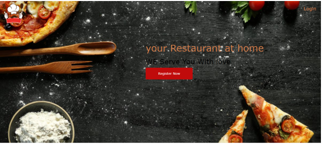
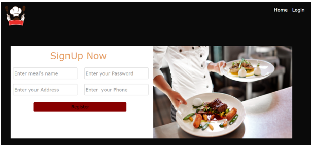
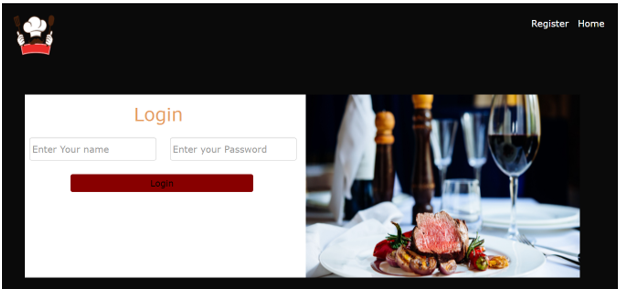
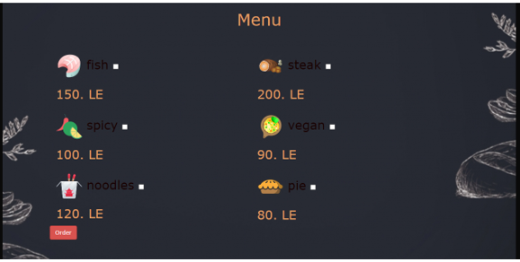
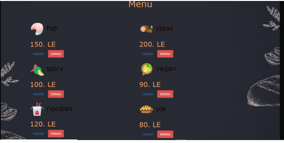
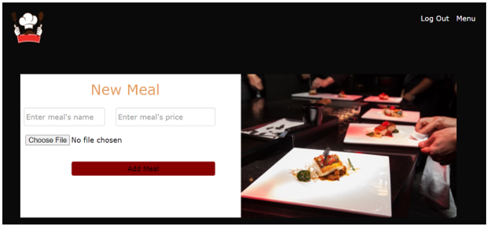
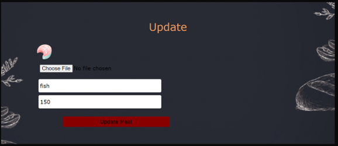

1. Introduction:

Online Restaurant is a food ordering website with two different view sides one
for the customer where he can register, login, or order one or more meals and
all his data and actions will be stored in the database. and the other views are
for the admin or the owner where he can display the menu and modify it with many
options as adding, updating, or deleting any meal in the menu. The website is
dynamic, and the back-end is written in php.

2. Technologies and tools:

**Frontend:**

·         HTML

·         CSS

·         JavaScript

·         AJAX

·         Bootstrap

**Backend:**

·         Php

·         SQL

·         PhpMyAdmin

 

 

